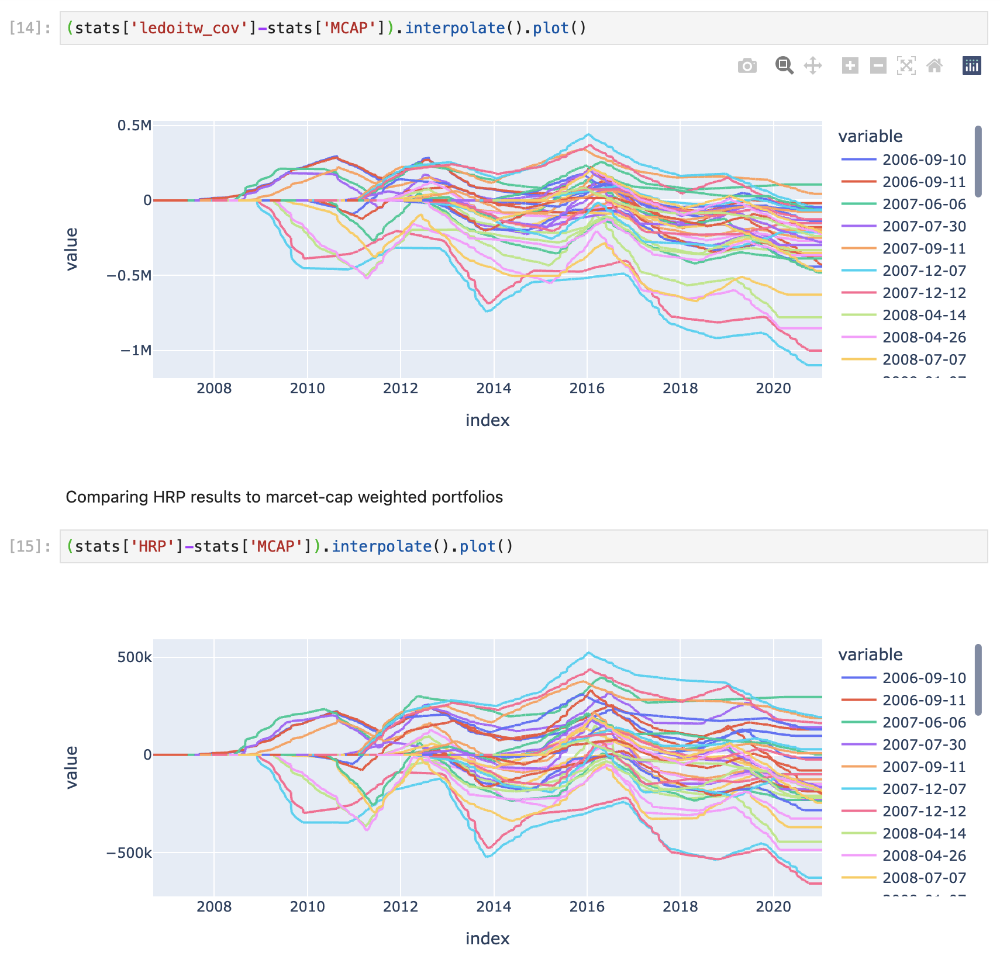

# Python notebooks and small library for basic analysis of stocks
I want to choose good portolio from list of available shares.
My requirements are:

0. I want to store price and volume history locally
1. I do not want to re-allocate portfolio too often (at most 4 times a year)
2. I want to backtest various portolio allocation strategies, i.e. test how they would have worked in the past.
3. Fees need to be taken into account. Assume that fee is 0.02% for each operation (buy or sell)

I found several ways to compose a portfolio using [pypfopt](https://github.com/robertmartin8/PyPortfolioOpt) package:
  * Markovitz optimal portfolio (max Sharpie portfolio)
  * Using Ledoit Wolf caovariance shrinkage
  * Minimal volatility portfolio
  * Market capitalization-weighted portfolio
  * Hierarchical Risk Parity

## Requirements

1. Install [poetry](https://python-poetry.org/docs/) dependency management system for python.
2. I also prefer to have all dependencies locally in .venv directory.
```
poetry config virtualenvs.in-project true
```
3. Install all dependencies, see [pyptoject.toml](pyproject.toml)
```
poetry install
```
3. Start jupyter in correct environment
```
poetry run jupyter-lab
```

## Example
The following graphs were obtained using the [analyze_portfolios.ipynb](analyze_portfolios.ipynb).

0. We select randomly 50 shares, which we will work with.

`['AXTA', 'TOL', 'FAF', 'BSET', 'SJT', 'PHT', 'ITT', 'SNY', 'MHN',
       'ESE', 'TGLS', 'IMKTA', 'FIS', 'MYD', 'EVT', 'MDT', 'HRB', 'TY', 'NEP', 'AMAT', 'AGIO', 'TTEK', 'APA', 'VMC', 'FELE', 'GLW', 'PLBC', 'HLT', 'MGU', 'BKEPP', 'NUV', 'OMI', 'FBIZ', 'AVK', 'CRT', 'KR', 'USPH', 'OSBC', 'FMS', 'SYF', 'NIM', 'BKR', 'DFS', 'WSFS', 'FCX', 'RGLD', 'AFYA', 'EFC', 'AMCX', 'RLGY'])`
1. Assume that we have $10M in cash and an empty portfolio at 2010-8-8.
2. Then we compute portfolio value for each strategy: MCAP, min volatility with Ledoit-Wolf covariance shrinkage, and HRP.
3. We randomize the start date. In this example 40 random dates were generated whithin interval [2006-8-8,2014-8-8].
For each of the starting date the annual portfolio allocation procedure was restarted.

In the end we compute the difference from the MCAP strategy to the Ledoit-Wolf and HRP ones (upper picture for Ledoit Wolf minimal volatility portfolios, and lower for HRP):

Negative values of the portfolio mean that MCAP strategy works.

It seems, that the HRP works a bit better for this example

## Downloading tickers along with their info
Package **yahoo_fin** is used to download list of tickers listed for S&P500, NYSE, and NASDAQ, see

```download_ticker_info.ipynb```

Download ticker price and volume history

```download_price_history.ipynb```

data is saved into ```info/```

## Downloading price and volume historical data

```analyze_portfolios.ipynb```

Historical data for each ticker is saved into ```priceVolData/``` directory 